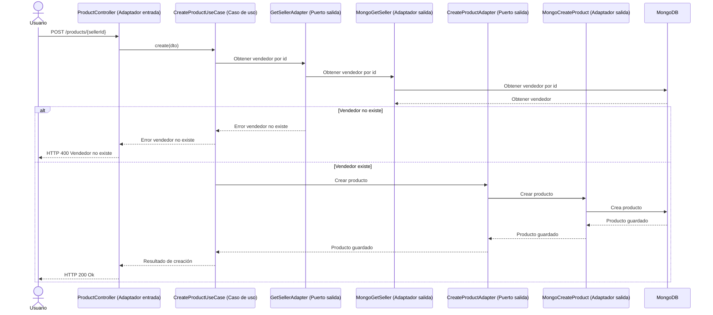

```mermaid
sequenceDiagram
    actor Usuario
    participant Controller as ProductController (Adaptador entrada)
    participant UseCase as CreateProductUseCase (Caso de uso)
    participant GetSellerAdapter as GetSellerAdapter (Puerto salida)
    participant MongoGetSeller as MongoGetSeller (Adaptador salida)
    participant CreateProductAdapter as CreateProductAdapter (Puerto salida)
    participant MongoCreateProduct as MongoCreateProduct (Adaptador salida)
    participant DB as MongoDB

    Usuario->>Controller: POST /products/{sellerId}
    Controller->>UseCase: create(dto)
    UseCase->>GetSellerAdapter: Obtener vendedor por id
    GetSellerAdapter->>MongoGetSeller: Obtener vendedor por id
    MongoGetSeller->>DB: Obtener vendedor por id
    DB-->>MongoGetSeller: Obtener vendedor
    alt Vendedor no existe
        GetSellerAdapter-->>UseCase: Error vendedor no existe
        UseCase-->>Controller: Error vendedor no existe
        Controller-->>Usuario: HTTP 400 Vendedor no existe
    else Vendedor existe
        UseCase->>CreateProductAdapter: Crear producto
        CreateProductAdapter->>MongoCreateProduct: Crear producto
        MongoCreateProduct->>DB: Crea producto
        DB-->>MongoCreateProduct: Producto guardado
        MongoCreateProduct-->>CreateProductAdapter: Producto guardado
        CreateProductAdapter-->>UseCase: Producto guardado
        UseCase-->>Controller: Resultado de creación
        Controller-->>Usuario: HTTP 200 Ok
    end

```