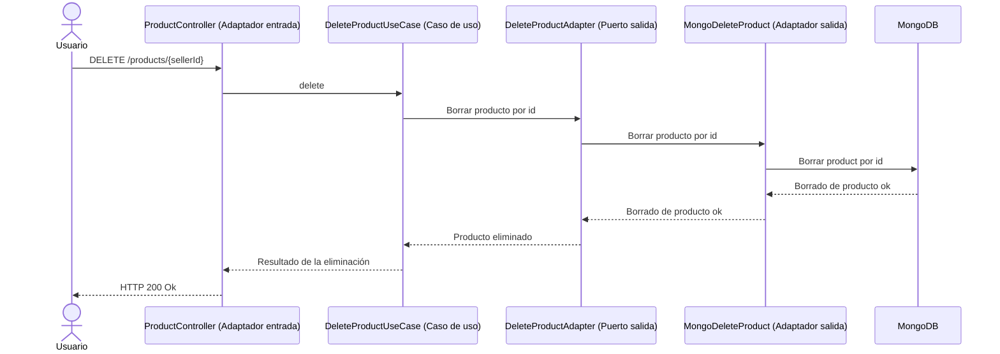

```mermaid
sequenceDiagram
    actor Usuario
    participant Controller as ProductController (Adaptador entrada)
    participant UseCase as DeleteProductUseCase (Caso de uso)
    participant DeleteProductAdapter as DeleteProductAdapter (Puerto salida)
    participant MongoDeleteProduct as MongoDeleteProduct (Adaptador salida)
    participant DB as MongoDB

    Usuario->>Controller: DELETE /products/{sellerId}
    Controller->>UseCase: delete
    UseCase->>DeleteProductAdapter: Borrar producto por id
    DeleteProductAdapter->>MongoDeleteProduct: Borrar producto por id
    MongoDeleteProduct->>DB: Borrar product por id
    DB-->>MongoDeleteProduct: Borrado de producto ok
    MongoDeleteProduct-->>DeleteProductAdapter: Borrado de producto ok
    DeleteProductAdapter-->>UseCase: Producto eliminado
    UseCase-->>Controller: Resultado de la eliminación
    Controller-->>Usuario: HTTP 200 Ok
```