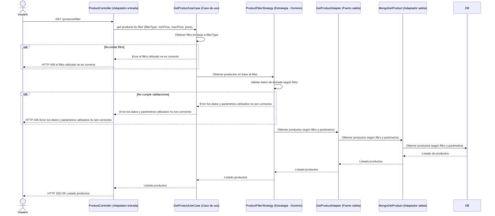

```mermaid
sequenceDiagram
    actor Usuario
    participant Controller as ProductController (Adaptador entrada)
    participant UseCase as GetProductUseCase (Caso de uso)
    participant Filter as ProductFilterStrategy (Estrategia - Dominio)
    participant GetProductAdapter as GetProductAdapter (Puerto salida)
    participant MongoGetProduct as MongoGetProduct (Adaptador salida)
    
    Usuario->>Controller: GET /products/filter
    Controller->>UseCase: get products by filter (filterType, minPrice, maxPrice, price)
    UseCase->>UseCase: Obtener filtro en base a filterType
    opt No existe filtro
        UseCase-->>Controller: Error el filtro utilizado no es correcto
        Controller-->>Usuario: HTTP 400 el filtro utilizado no es correcto
    end
    UseCase->>Filter: Obtener productos en base al filter
    Filter->>Filter: Validar datos de entrada según filtro
    opt No cumple validaciones
        Filter-->>UseCase: Error los datos y parámetros utilizados no son correctos
        UseCase-->>Controller: Error los datos y parámetros utilizados no son correctos
        Controller-->>Usuario: HTTP 400 Error los datos y parámetros utilizados no son correctos
    end
    Filter->>GetProductAdapter: Obtener productos según filtro y parámetros
    GetProductAdapter->>MongoGetProduct: Obtener productos según filtro y parámetros
    MongoGetProduct->>DB: Obtener productos según filtro y parámetros
    DB-->>MongoGetProduct: Listado de productos
    MongoGetProduct-->>GetProductAdapter: Listado productos 
    GetProductAdapter-->>Filter: Listado productos 
    Filter-->>UseCase: Listado productos 
    UseCase-->>Controller: Listado productos 
    Controller-->>Usuario: HTTP 200 OK Listado productos 
```