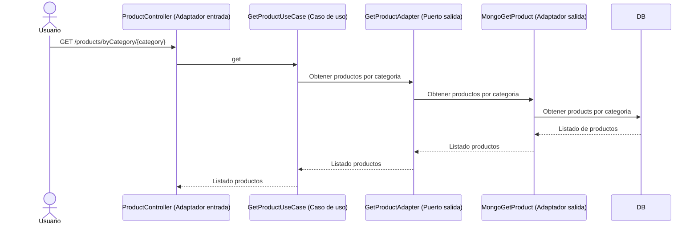

```mermaid
sequenceDiagram
    actor Usuario
    participant Controller as ProductController (Adaptador entrada)
    participant UseCase as GetProductUseCase (Caso de uso)
    
    participant GetProductAdapter as GetProductAdapter (Puerto salida)
    participant MongoGetProduct as MongoGetProduct (Adaptador salida)
    
    Usuario->>Controller: GET /products/byCategory/{category}
    Controller->>UseCase: get
    UseCase->>GetProductAdapter: Obtener productos por categoria
    GetProductAdapter->>MongoGetProduct: Obtener productos por categoria
    MongoGetProduct->>DB: Obtener products por categoria
    DB-->>MongoGetProduct: Listado de productos
    MongoGetProduct-->>GetProductAdapter: Listado productos 
    GetProductAdapter-->>UseCase: Listado productos 
    UseCase-->>Controller: Listado productos
```