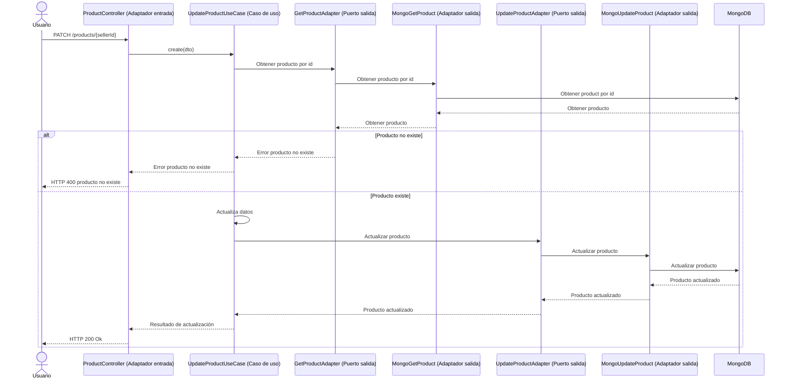

```mermaid
sequenceDiagram
    actor Usuario
    participant Controller as ProductController (Adaptador entrada)
    participant UseCase as UpdateProductUseCase (Caso de uso)
    participant GetProductAdapter as GetProductAdapter (Puerto salida)
    participant MongoGetProduct as MongoGetProduct (Adaptador salida)
    participant UpdateProductAdapter as UpdateProductAdapter (Puerto salida)
    participant MongoUpdateProduct as MongoUpdateProduct (Adaptador salida)
    participant DB as MongoDB

    Usuario->>Controller: PATCH /products/{sellerId}
    Controller->>UseCase: create(dto)
    UseCase->>GetProductAdapter: Obtener producto por id
    GetProductAdapter->>MongoGetProduct: Obtener producto por id
    MongoGetProduct->>DB: Obtener product por id
    DB-->>MongoGetProduct: Obtener producto
    MongoGetProduct-->>GetProductAdapter: Obtener producto 
    alt Producto no existe
        GetProductAdapter-->>UseCase: Error producto no existe
        UseCase-->>Controller: Error producto no existe
        Controller-->>Usuario: HTTP 400 producto no existe
    else Producto existe
        UseCase->>UseCase: Actualiza datos
        UseCase->>UpdateProductAdapter: Actualizar producto
        UpdateProductAdapter->>MongoUpdateProduct: Actualizar producto
        MongoUpdateProduct->>DB: Actualizar producto
        DB-->>MongoUpdateProduct: Producto actualizado
        MongoUpdateProduct-->>UpdateProductAdapter: Producto actualizado
        UpdateProductAdapter-->>UseCase: Producto actualizado
        UseCase-->>Controller: Resultado de actualización
        Controller-->>Usuario: HTTP 200 Ok
    end
```