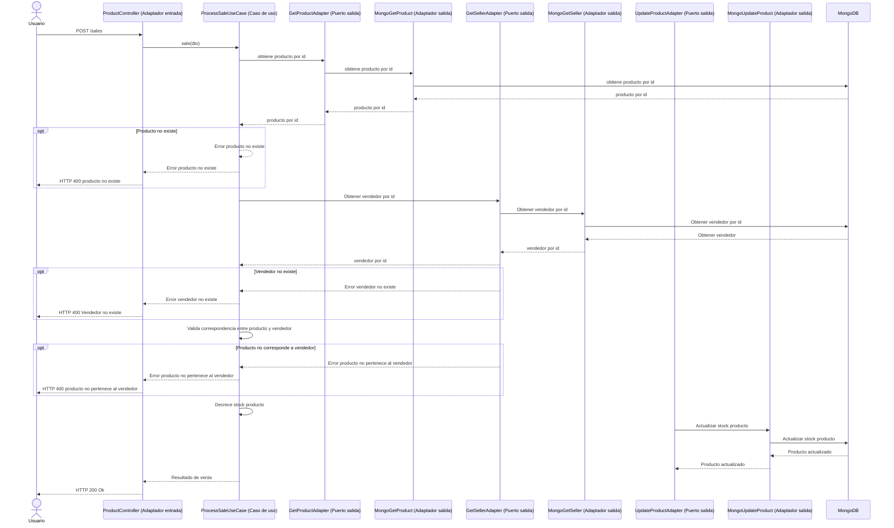

```mermaid
sequenceDiagram
    actor Usuario
    participant Controller as ProductController (Adaptador entrada)
    participant UseCase as ProcessSaleUseCase (Caso de uso)
    participant GetProductAdapter as GetProductAdapter (Puerto salida)
    participant MongoGetProduct as MongoGetProduct (Adaptador salida)
    
    participant GetSellerAdapter as GetSellerAdapter (Puerto salida)
    participant MongoGetSeller as MongoGetSeller (Adaptador salida)
    
    participant UpdateProductAdapter as UpdateProductAdapter (Puerto salida)
    participant MongoUpdateProduct as MongoUpdateProduct (Adaptador salida)
    participant DB as MongoDB

    Usuario->>Controller: POST /sales
    Controller->>UseCase: sale(dto)
    UseCase->>GetProductAdapter: obtiene producto por id
    GetProductAdapter->>MongoGetProduct: obtiene producto por id
    MongoGetProduct->>DB: obtiene producto por id
    DB-->>MongoGetProduct: producto por id
    MongoGetProduct-->>GetProductAdapter: producto por id
    GetProductAdapter-->>UseCase: producto por id
    opt Producto no existe
        UseCase-->>UseCase: Error producto no existe
        UseCase-->>Controller: Error producto no existe
        Controller-->>Usuario: HTTP 400 producto no existe
    end
    
    UseCase->>GetSellerAdapter: Obtener vendedor por id
    GetSellerAdapter->>MongoGetSeller: Obtener vendedor por id
    MongoGetSeller->>DB: Obtener vendedor por id
    DB-->>MongoGetSeller: Obtener vendedor
    MongoGetSeller-->>GetSellerAdapter: vendedor por id
    GetSellerAdapter-->>UseCase: vendedor por id
    
    opt Vendedor no existe
        GetSellerAdapter-->>UseCase: Error vendedor no existe
        UseCase-->>Controller: Error vendedor no existe
        Controller-->>Usuario: HTTP 400 Vendedor no existe
    end
    
    UseCase->>UseCase: Valida correspondencia entre producto y vendedor
    opt Producto no corresponde a vendedor
        GetSellerAdapter-->>UseCase: Error producto no pertenece al vendedor
        UseCase-->>Controller: Error producto no pertenece al vendedor
        Controller-->>Usuario: HTTP 400 producto no pertenece al vendedor
    end
    
    UseCase->>UseCase: Decrece stock producto
    UpdateProductAdapter->>MongoUpdateProduct: Actualizar stock producto
    MongoUpdateProduct->>DB: Actualizar stock producto
    DB-->>MongoUpdateProduct: Producto actualizado
    MongoUpdateProduct-->>UpdateProductAdapter: Producto actualizado
    UseCase-->>Controller: Resultado de venta
    Controller-->>Usuario: HTTP 200 Ok
```