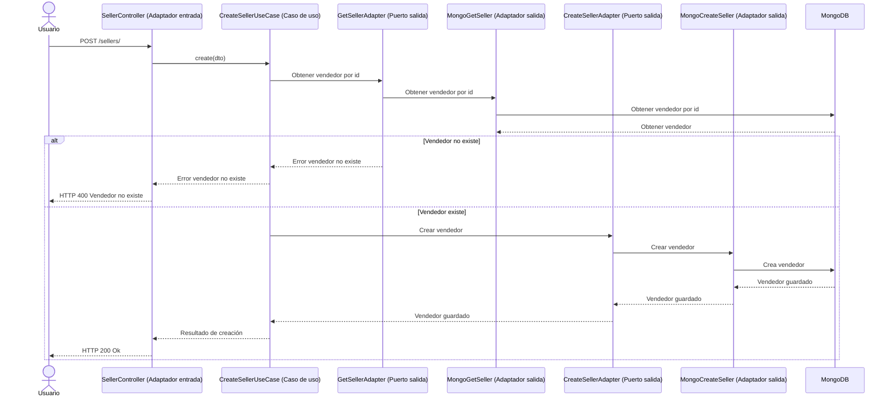

```mermaid
sequenceDiagram
    actor Usuario
    participant Controller as SellerController (Adaptador entrada)
    participant UseCase as CreateSellerUseCase (Caso de uso)
    participant GetSellerAdapter as GetSellerAdapter (Puerto salida)
    participant MongoGetSeller as MongoGetSeller (Adaptador salida)
    participant CreateSellerAdapter as CreateSellerAdapter (Puerto salida)
    participant MongoCreateSeller as MongoCreateSeller (Adaptador salida)
    participant DB as MongoDB

    Usuario->>Controller: POST /sellers/
    Controller->>UseCase: create(dto)
    UseCase->>GetSellerAdapter: Obtener vendedor por id
    GetSellerAdapter->>MongoGetSeller: Obtener vendedor por id
    MongoGetSeller->>DB: Obtener vendedor por id
    DB-->>MongoGetSeller: Obtener vendedor
    alt Vendedor no existe
        GetSellerAdapter-->>UseCase: Error vendedor no existe
        UseCase-->>Controller: Error vendedor no existe
        Controller-->>Usuario: HTTP 400 Vendedor no existe
    else Vendedor existe
        UseCase->>CreateSellerAdapter: Crear vendedor
        CreateSellerAdapter->>MongoCreateSeller: Crear vendedor
        MongoCreateSeller->>DB: Crea vendedor
        DB-->>MongoCreateSeller: Vendedor guardado
        MongoCreateSeller-->>CreateSellerAdapter: Vendedor guardado
        CreateSellerAdapter-->>UseCase: Vendedor guardado
        UseCase-->>Controller: Resultado de creación
        Controller-->>Usuario: HTTP 200 Ok
    end
```