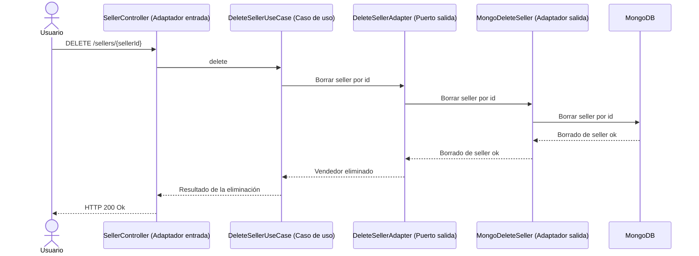

```mermaid
sequenceDiagram
    actor Usuario
    participant Controller as SellerController (Adaptador entrada)
    participant UseCase as DeleteSellerUseCase (Caso de uso)
    participant DeleteSellerAdapter as DeleteSellerAdapter (Puerto salida)
    participant MongoDeleteSeller as MongoDeleteSeller (Adaptador salida)
    participant DB as MongoDB

    Usuario->>Controller: DELETE /sellers/{sellerId}
    Controller->>UseCase: delete
    UseCase->>DeleteSellerAdapter: Borrar seller por id
    DeleteSellerAdapter->>MongoDeleteSeller: Borrar seller por id
    MongoDeleteSeller->>DB: Borrar seller por id
    DB-->>MongoDeleteSeller: Borrado de seller ok
    MongoDeleteSeller-->>DeleteSellerAdapter: Borrado de seller ok
    DeleteSellerAdapter-->>UseCase: Vendedor eliminado
    UseCase-->>Controller: Resultado de la eliminación
    Controller-->>Usuario: HTTP 200 Ok
```