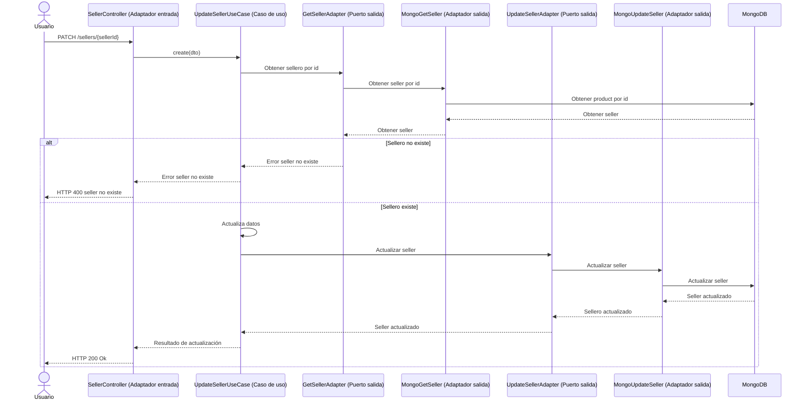

```mermaid
sequenceDiagram
    actor Usuario
    participant Controller as SellerController (Adaptador entrada)
    participant UseCase as UpdateSellerUseCase (Caso de uso)
    participant GetSellerAdapter as GetSellerAdapter (Puerto salida)
    participant MongoGetSeller as MongoGetSeller (Adaptador salida)
    participant UpdateSellerAdapter as UpdateSellerAdapter (Puerto salida)
    participant MongoUpdateSeller as MongoUpdateSeller (Adaptador salida)
    participant DB as MongoDB

    Usuario->>Controller: PATCH /sellers/{sellerId}
    Controller->>UseCase: create(dto)
    UseCase->>GetSellerAdapter: Obtener sellero por id
    GetSellerAdapter->>MongoGetSeller: Obtener seller por id
    MongoGetSeller->>DB: Obtener product por id
    DB-->>MongoGetSeller: Obtener seller
    MongoGetSeller-->>GetSellerAdapter: Obtener seller 
    alt Sellero no existe
        GetSellerAdapter-->>UseCase: Error seller no existe
        UseCase-->>Controller: Error seller no existe
        Controller-->>Usuario: HTTP 400 seller no existe
    else Sellero existe
        UseCase->>UseCase: Actualiza datos
        UseCase->>UpdateSellerAdapter: Actualizar seller
        UpdateSellerAdapter->>MongoUpdateSeller: Actualizar seller
        MongoUpdateSeller->>DB: Actualizar seller
        DB-->>MongoUpdateSeller: Seller actualizado
        MongoUpdateSeller-->>UpdateSellerAdapter: Sellero actualizado
        UpdateSellerAdapter-->>UseCase: Seller actualizado
        UseCase-->>Controller: Resultado de actualización
        Controller-->>Usuario: HTTP 200 Ok
    end
```