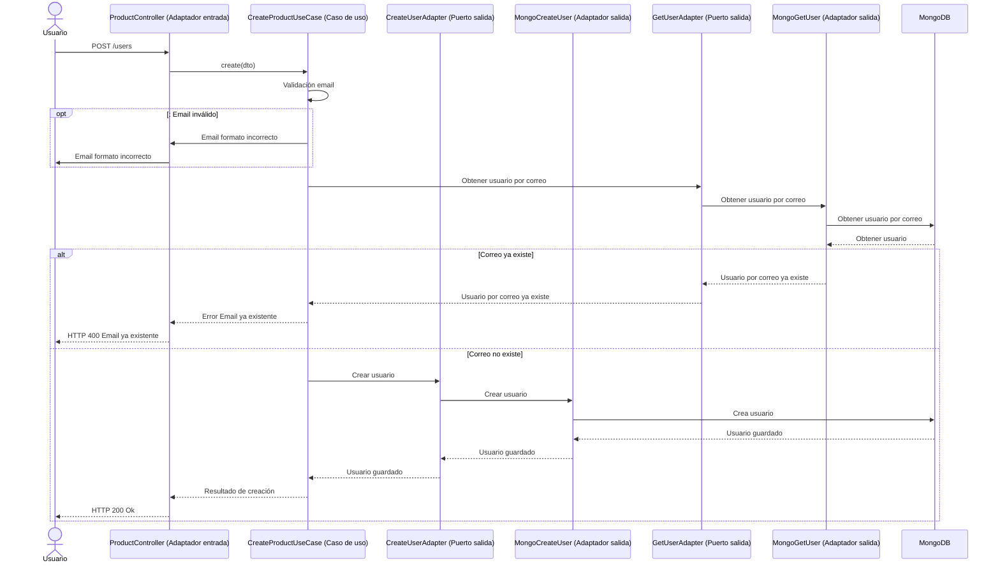

```mermaid
sequenceDiagram
    actor Usuario
    participant Controller as ProductController (Adaptador entrada)
    participant UseCase as CreateProductUseCase (Caso de uso)
    participant CreateUserAdapter as CreateUserAdapter (Puerto salida)
    participant MongoCreateUser as MongoCreateUser (Adaptador salida)
    participant GetUserAdapter as GetUserAdapter (Puerto salida)
    participant MongoGetUser as MongoGetUser (Adaptador salida)
    participant DB as MongoDB

    Usuario->>Controller: POST /users
    Controller->>UseCase: create(dto)
    UseCase->>UseCase: Validación email
    opt: Email inválido
        UseCase->>Controller: Email formato incorrecto
        Controller->>Usuario: Email formato incorrecto
    end
    UseCase->>GetUserAdapter: Obtener usuario por correo
    GetUserAdapter->>MongoGetUser: Obtener usuario por correo
    MongoGetUser->>DB: Obtener usuario por correo
    DB-->>MongoGetUser: Obtener usuario
    alt Correo ya existe
        MongoGetUser-->>GetUserAdapter: Usuario por correo ya existe
        GetUserAdapter-->>UseCase: Usuario por correo ya existe
        UseCase-->>Controller: Error Email ya existente
        Controller-->>Usuario: HTTP 400 Email ya existente
    else Correo no existe
        UseCase->>CreateUserAdapter: Crear usuario
        CreateUserAdapter->>MongoCreateUser: Crear usuario
        MongoCreateUser->>DB: Crea usuario
        DB-->>MongoCreateUser: Usuario guardado
        MongoCreateUser-->>CreateUserAdapter: Usuario guardado
        CreateUserAdapter-->>UseCase: Usuario guardado
        UseCase-->>Controller: Resultado de creación
        Controller-->>Usuario: HTTP 200 Ok
    end
```