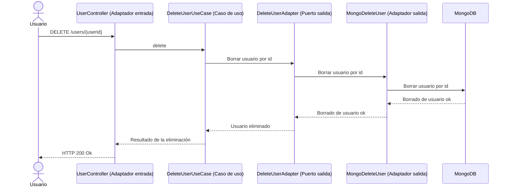

```mermaid
sequenceDiagram
    actor Usuario
    participant Controller as UserController (Adaptador entrada)
    participant UseCase as DeleteUserUseCase (Caso de uso)
    participant DeleteUserAdapter as DeleteUserAdapter (Puerto salida)
    participant MongoDeleteUser as MongoDeleteUser (Adaptador salida)
    participant DB as MongoDB

    Usuario->>Controller: DELETE /users/{userId}
    Controller->>UseCase: delete
    UseCase->>DeleteUserAdapter: Borrar usuario por id
    DeleteUserAdapter->>MongoDeleteUser: Borrar usuario por id
    MongoDeleteUser->>DB: Borrar usuario por id
    DB-->>MongoDeleteUser: Borrado de usuario ok
    MongoDeleteUser-->>DeleteUserAdapter: Borrado de usuario ok
    DeleteUserAdapter-->>UseCase: Usuario eliminado
    UseCase-->>Controller: Resultado de la eliminación
    Controller-->>Usuario: HTTP 200 Ok
```