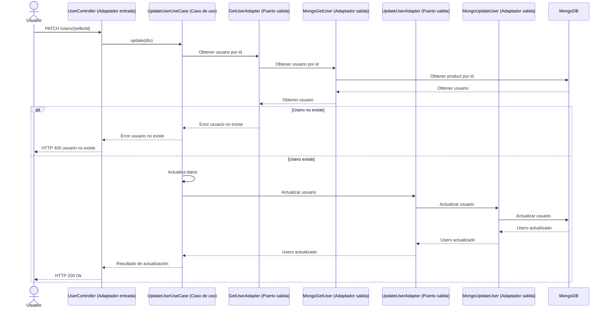

```mermaid
sequenceDiagram
    actor Usuario
    participant Controller as UserController (Adaptador entrada)
    participant UseCase as UpdateUserUseCase (Caso de uso)
    participant GetUserAdapter as GetUserAdapter (Puerto salida)
    participant MongoGetUser as MongoGetUser (Adaptador salida)
    participant UpdateUserAdapter as UpdateUserAdapter (Puerto salida)
    participant MongoUpdateUser as MongoUpdateUser (Adaptador salida)
    participant DB as MongoDB

    Usuario->>Controller: PATCH /users/{sellerId}
    Controller->>UseCase: update(dto)
    UseCase->>GetUserAdapter: Obtener usuario por id
    GetUserAdapter->>MongoGetUser: Obtener usuario por id
    MongoGetUser->>DB: Obtener product por id
    DB-->>MongoGetUser: Obtener usuario
    MongoGetUser-->>GetUserAdapter: Obtener usuario 
    alt Usero no existe
        GetUserAdapter-->>UseCase: Error usuario no existe
        UseCase-->>Controller: Error usuario no existe
        Controller-->>Usuario: HTTP 400 usuario no existe
    else Usero existe
        UseCase->>UseCase: Actualiza datos
        UseCase->>UpdateUserAdapter: Actualizar usuario
        UpdateUserAdapter->>MongoUpdateUser: Actualizar usuario
        MongoUpdateUser->>DB: Actualizar usuario
        DB-->>MongoUpdateUser: Usero actualizado
        MongoUpdateUser-->>UpdateUserAdapter: Usero actualizado
        UpdateUserAdapter-->>UseCase: Usero actualizado
        UseCase-->>Controller: Resultado de actualización
        Controller-->>Usuario: HTTP 200 Ok
    end
```